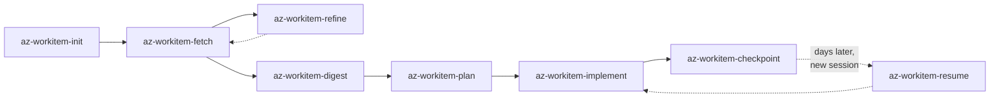

# Az Work Item Skills — Developer Workflow

## Overview



## Skills

| Skill                    | Runs                                             | Prerequisite |
| ------------------------ | ------------------------------------------------ | ------------ |
| `az-workitem-init`       | Once per workspace                               | None         |
| `az-workitem-fetch`      | Once per work item; always re-run after `refine` | `init`       |
| `az-workitem-refine`     | Optional; always followed by `fetch`             | `fetch`      |
| `az-workitem-digest`     | Once per work item                               | `fetch`      |
| `az-workitem-plan`       | Once to generate; re-run to view/update progress | `digest`     |
| `az-workitem-implement`  | Once or multiple times for specific phases       | `plan`       |
| `az-workitem-checkpoint` | Whenever attention leaves the work item          | `fetch`      |
| `az-workitem-resume`     | First thing in a new session on an existing item | `fetch`      |

`fetch` and `digest` each own one output. `plan` and `implement` additionally write any files their research or steps produce along the way. `checkpoint` owns `journal.md` outright — it is the only skill that writes it, and `resume` the only one that reads it. `resume` writes nothing at all. See [Data Layout](#data-layout).

## Picking Work Back Up

Work gets put down. An interrupt arrives, the day ends, another work item takes priority — and the session that held all the context is gone. Two skills exist for that boundary:

- **`az-workitem-checkpoint`** runs when attention leaves — end of day, an interrupt, a switch to something unrelated. It records the session in `journal.md`: where the code is, what was done, what was decided **and why**, what is blocking, and the single next action.
- **`az-workitem-resume`** runs first in the new session. It reads `journal.md`, `plan.md`, `digest.md` and the prior artifacts, inspects the live git state, checks whether the ADO work item drifted since it was last fetched, and prints one briefing ending in the next action. It is read-only and starts nothing.

What makes this work is that the two halves record different things. `plan.md` says what state the work is in — that is what the `In Progress` and `Blocked` statuses are for. `journal.md` says *why* it is in that state, which is the half that only exists in a live session and is otherwise lost the moment it ends.

**`journal.md` belongs to these two skills alone.** `checkpoint` is the only writer, `resume` the only reader; `plan` and `implement` never open it. That boundary is deliberate: once `resume` has briefed a session, the journal's contents are already in the conversation, so a later skill re-reading the file would only spend its context on what it already has. The trade is that `checkpoint` has to actually run — it is what converts a session's reasoning into something the next one can read, and nothing else does it.

## Data Layout

Every skill reads and writes under one directory per work item:

```txt
~/.az-workitems/{id}/
├── digest.md              ← az-workitem-digest
├── journal.md             ← az-workitem-checkpoint only (newest entry first)
├── plan.md                ← az-workitem-plan  (the index: each step names its artifacts)
├── raw/                   ← az-workitem-fetch (raw.json + attachments)
└── artifacts/             ← az-workitem-plan and az-workitem-implement
    ├── planning/          ← research the plan was built on
    ├── shared/            ← artifacts spanning more than one step
    ├── step-1.1/          ← probe.js, probe.output.json, README.md
    └── step-1.3/
```

`journal.md` is append-only in the strongest sense in here: an entry is one session's account of itself, and unlike a plan, a digest or a probe output, nothing can regenerate it. Entries are added above the newest one so the current state is the top of the file, and an existing entry is never edited or deleted — a correction is a new entry that says what it corrects.

`artifacts/` is created lazily, the first time a run produces a file that is not a change to the codebase — a read-only probe, its captured output, a data extract, or a note recording what was found. A capture is named for the format it holds — `.json`, `.csv`, `.md`, and `.txt` by default — so a later run can parse it instead of re-running the script to get the data in a usable shape.

Each of the two writers owns one part of it. `az-workitem-plan` writes only to `planning/`, where it stores the research that settles a fact the plan's shape depends on; it must ask before running any script it writes, since no approved step authorizes execution. `az-workitem-implement` writes only to `step-{N}.{M}/` and `shared/`, and reads `planning/` to see why a step is shaped the way it is.

A step directory is named after the `### Step {N}.{M}` heading it belongs to, and the step's `**Artifacts:**` line in `plan.md` points back at it. That back-link is what makes the evidence findable in a later session: `plan.md` is already the first thing `az-workitem-plan` and `az-workitem-implement` read, so a step's prior measurements are read before it is re-planned or re-run, rather than being silently re-derived.

Three consequences worth knowing:

- **Renumbering is a rename.** Steps are renumbered whenever the plan's shape calls for it, but a step number is also a directory name, so the same pass renames the directories and updates every reference to the old numbers.
- **Artifacts are append-only.** A measurement taken against a live system is the one thing in here that cannot be regenerated, so a later run writes a new file alongside an existing one rather than replacing it.
- **Scripts need permission to run.** Both skills write script artifacts freely and execute none of them until the user approves that specific script.

## Typical Workflow

```mermaid
flowchart TD
    START([Start]) --> PICKUP{"Picking up a\nwork item already\nunderway?"}

    PICKUP -->|Yes| RESUME
    PICKUP -->|"No — new work item"| INIT_CHECK

    RESUME["/az-workitem-resume {id}\n────────────────\nReads journal.md + plan.md + digest.md\nInspects live git state\nChecks ADO for drift since last fetch\nPrints a briefing ending in the next action\n\nRead-only; starts nothing"]

    RESUME --> RESUME_STALE{"ADO changed\nwhile away?"}
    RESUME_STALE -->|"Yes — fold it in"| FETCH
    RESUME_STALE -->|No| IMPLEMENT

    INIT_CHECK{"Workspace\ninitialized?"}

    INIT_CHECK -->|No| INIT
    INIT_CHECK -->|"Yes — skip"| FETCH

    INIT["/az-workitem-init\n────────────────\nDefaults: org edwire, project EW.Educate\nAcquire an az CLI token & validate it\nWrite config.json incl. the token\nLater runs refresh it near expiry\n\nRun once per machine"]

    INIT --> FETCH

    FETCH["/az-workitem-fetch {id}\n────────────────\nDownload raw.json from ADO\nFetch attachments & inline images\nWrites to ~/.az-workitems/{id}/raw/"]

    FETCH --> REFINE_OPT{"Refine\nrequirements?"}

    REFINE_OPT -->|Optional| REFINE
    REFINE_OPT -->|"Skip to digest"| DIGEST

    REFINE["/az-workitem-refine {id}\n────────────────\n3-round structured interview:\n  · Goal & success criteria\n  · Domain model & data\n  · Edge cases & failure modes\nPosts Q&A summary as ADO comment"]

    REFINE --> FETCH2["/az-workitem-fetch {id}\n────────────────\nAlways re-fetch after refine\nto pull in the posted Q&A comment\nand latest ADO discussion"]

    FETCH2 --> CLEAR{"Requirements\nclear?"}
    CLEAR -->|"No — refine again"| REFINE
    CLEAR -->|Yes| DIGEST

    DIGEST["/az-workitem-digest {id}\n────────────────\nReads raw.json + attachments\nAnalyzes description, acceptance\ncriteria, discussion & related items\nWrites digest.md"]

    DIGEST --> PLAN

    PLAN["/az-workitem-plan {id}\n────────────────\nReads digest.md + artifacts/\nDiscovers services in the codebase\nResearches unknowns → artifacts/planning/\nEstimates effort per phase\nWrites phased plan.md with checkboxes\n\nRe-running shows progress & updates"]

    PLAN --> IMPLEMENT

    IMPLEMENT["/az-workitem-implement {id} [phases|all]\n────────────────\nReads plan.md + digest.md + artifacts/\nImplements one, several, or all phases\nProbes, outputs & notes → artifacts/step-N.M/\nBuilds affected projects after each phase\nTracks step status in plan.md\nReports decisions & inferences in chat\n\nNever touches journal.md"]

    IMPLEMENT --> PHASES_DONE{"All phases\ncomplete?"}
    PHASES_DONE -->|Yes| END([Done])
    PHASES_DONE -->|No| SWITCHING{"Attention leaving\nthis work item?"}

    SWITCHING -->|"No — keep going"| IMPLEMENT
    SWITCHING -->|Yes| CHECKPOINT

    CHECKPOINT["/az-workitem-checkpoint {id}\n────────────────\nRecords the session in journal.md:\n  · where the code is (repo, branch, tree)\n  · what was done\n  · what was decided, and why\n  · what is blocking\n  · the single next action\n\nMakes no code changes"]

    CHECKPOINT -.->|"days later,\nnew session"| RESUME
```


