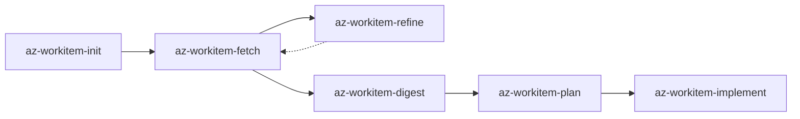

# Az Work Item Skills — Developer Workflow

## Overview

## Skills

| Skill                   | Runs                                             | Prerequisite |
| ----------------------- | ------------------------------------------------ | ------------ |
| `az-workitem-init`      | Once per workspace                               | None         |
| `az-workitem-fetch`     | Once per work item; always re-run after `refine` | `init`       |
| `az-workitem-refine`    | Optional; always followed by `fetch`             | `fetch`      |
| `az-workitem-digest`    | Once per work item                               | `fetch`      |
| `az-workitem-plan`      | Once to generate; re-run to view/update progress | `digest`     |
| `az-workitem-implement` | Once or multiple times for specific phases       | `plan`       |

## Typical Workflow

```mermaid
flowchart TD
    START([Start]) --> INIT_CHECK{"Workspace\ninitialized?"}

    INIT_CHECK -->|No| INIT
    INIT_CHECK -->|"Yes — skip"| FETCH

    INIT["/az-workitem-init\n────────────────\nDefaults: org edwire, project EW.Educate\nAcquire an az CLI token & validate it\nWrite config.json incl. the token\nLater runs refresh it near expiry\n\nRun once per machine"]

    INIT --> FETCH

    FETCH["/az-workitem-fetch {id}\n────────────────\nDownload raw.json from ADO\nFetch attachments & inline images\nWrites to ~/.az-workitems/{id}/raw/"]

    FETCH --> REFINE_OPT{"Refine\nrequirements?"}

    REFINE_OPT -->|Optional| REFINE
    REFINE_OPT -->|"Skip to digest"| DIGEST

    REFINE["/az-workitem-refine {id}\n────────────────\n3-round structured interview:\n  · Goal & success criteria\n  · Domain model & data\n  · Edge cases & failure modes\nPosts Q&A summary as ADO comment"]

    REFINE --> FETCH2["/az-workitem-fetch {id}\n────────────────\nAlways re-fetch after refine\nto pull in the posted Q&A comment\nand latest ADO discussion"]

    FETCH2 --> CLEAR{"Requirements\nclear?"}
    CLEAR -->|"No — refine again"| REFINE
    CLEAR -->|Yes| DIGEST

    DIGEST["/az-workitem-digest {id}\n────────────────\nReads raw.json + attachments\nAnalyzes description, acceptance\ncriteria, discussion & related items\nWrites digest.md"]

    DIGEST --> PLAN

    PLAN["/az-workitem-plan {id}\n────────────────\nReads digest.md\nDiscovers services in the codebase\nEstimates effort per phase\nWrites phased plan.md with checkboxes\n\nRe-running shows progress & updates"]

    PLAN --> IMPLEMENT

    IMPLEMENT["/az-workitem-implement {id} [phases|all]\n────────────────\nReads plan.md + digest.md\nImplements one, several, or all phases\nBuilds affected projects after each phase\nMarks phases complete in plan.md"]

    IMPLEMENT --> PHASES_DONE{"All phases\ncomplete?"}
    PHASES_DONE -->|"No — run more phases"| IMPLEMENT
    PHASES_DONE -->|Yes| END([Done])
```

