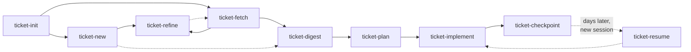

# Ticket Skills — Developer Workflow

## Overview



## Skills

| Skill               | Runs                                                   | Prerequisite     |
| ------------------- | ------------------------------------------------------ | ---------------- |
| `ticket-init`       | Once per machine per source                            | None             |
| `ticket-new`        | To create a ticket in a local store                    | `init`           |
| `ticket-fetch`      | Once per ticket; always re-run after `refine`          | `init`           |
| `ticket-refine` ⚠️   | Optional; followed by `fetch` where the source has one | `fetch` or `new` |
| `ticket-digest`     | Once per ticket                                        | `fetch` or `new` |
| `ticket-plan`       | Once to generate; re-run to view/update progress       | `digest`         |
| `ticket-implement`  | Once or multiple times for specific phases             | `plan`           |
| `ticket-checkpoint` | Whenever attention leaves the ticket                   | a ticket on disk |
| `ticket-resume`     | First thing in a new session on an existing ticket     | a ticket on disk |

⚠️ **`ticket-refine` is experimental** — under active development and not extensively tested. It is also the only skill in the suite that writes to a system outside this machine, so its confirmation gate is load-bearing: it never posts without an explicit yes. Prefer a scratch ticket while trying it out.

`fetch` and `digest` each own one output. `plan` and `implement` additionally write any files their research or steps produce along the way. `checkpoint` owns `journal.md` outright — it is the only skill that writes it, and `resume` the only one that reads it. `resume` writes nothing at all. See [Data Layout](#data-layout).

## Skills are drivers

No `ticket-*/SKILL.md` contains a field name, a URL, an API version, a credential command, a markup dialect, or a rule that only holds for one kind of work. Each states the workflow and names which file to read. Everything specific lives in one of three places:

| Directory                    | Holds                                                                                                              | Not a skill   |
| ---------------------------- | ------------------------------------------------------------------------------------------------------------------ | ------------- |
| `ticket-common/`             | the resolver `ticket.py`, the git collector, and the shared contracts `RESOLUTION.md`, `ARTIFACTS.md`, `STATUS.md` | no `SKILL.md` |
| `ticket-providers/{source}/` | one directory per ticket source — its manifest, its role files, its code                                           | no `SKILL.md` |
| `ticket-types/{type}.md`     | one file per kind of work                                                                                          | no `SKILL.md` |

Both sets are discovered by **glob**, never from a hardcoded list. Adding a source is adding a directory; adding a type is adding a file. Neither changes any `SKILL.md`.

Every driver invokes exactly one command — `ticket-common/ticket.py` — so a skill never has to know which sources exist in order to talk to one.

## Sources

| Role file                                                    | `ado` | `github` | `local` |
| ------------------------------------------------------------ | :---: | :------: | :-----: |
| `provider.json` — capabilities, prefixes, id shape, nouns    |   ✅   |    ✅     |    ✅    |
| `config.md` — what is stored, how the credential is acquired |   ✅   |    ✅     |    ✅    |
| `fetch.md` — how raw data lands on disk                      |   ✅   |    ✅     |    ❌    |
| `new.md` — how a ticket is created here                      |   ❌   |    ❌     |    ✅    |
| `schema.md` — where the content is, and the field map        |   ✅   |    ✅     |    ✅    |
| `types.md` — this source's vocabulary → a canonical type     |   ✅   |    ✅     |    ✅    |
| `links.md` — ticket / comment / attachment URL patterns      |   ✅   |    ✅     |    ✅    |
| `publish.md` — where a refinement summary goes               |   ✅   |    ✅     |    ✅    |
| `drift.md` — how to tell the local snapshot is stale         |   ✅   |    ✅     |    ✅    |

**The two absences are the mechanism, not an oversight.**

`local` has no `fetch.md`, and its `capabilities.fetch` is `false` — so `/ticket-fetch local:x` refuses, structurally, with no `if source == "local"` anywhere in any driver. There is nothing upstream to fetch from: a local ticket's `raw/ticket.md` *is* the source of truth.

Neither remote source has a `new.md` — so `/ticket-new` refuses them, and the absence documents that creating an upstream ticket is out of scope rather than forgotten.

A missing role file is always a **reported gap**, never a licence to substitute another source's.

## Types

The second modular axis. The source decides how to talk to whatever holds the ticket; the **type** decides what shape the work is and what proves it done.

| Type         | Deliverable                  | Done means                                                                                         |
| ------------ | ---------------------------- | -------------------------------------------------------------------------------------------------- |
| `user-story` | shippable behaviour          | the acceptance criteria are demonstrable                                                           |
| `task`       | a bounded change             | the change exists and builds                                                                       |
| `bug`        | a fix plus a regression test | the repro no longer reproduces, and a test covers it                                               |
| `spike`      | **a written finding**        | the question is answered in writing — including when the answer is "no"                            |
| `tech-debt`  | restructuring only           | **behaviour unchanged, structure improved** — the existing tests pass before and after, unmodified |

A ticket's type is resolved once, by its source's `types.md`, and recorded in `ticket.json`, so every later skill agrees without re-deriving it. Any driver accepts `--type` to override. A native type that maps to nothing falls back to `task` and **says so** — never silently.

The two that carry the most weight are `spike` and `tech-debt`, because each inverts a default: a spike that touched no source file is a **complete** run, and a tech-debt run whose tests needed editing to pass is a **failure to report**, not progress.

## Picking Work Back Up

Work gets put down. An interrupt arrives, the day ends, another ticket takes priority — and the session that held all the context is gone. Two skills exist for that boundary:

- **`ticket-checkpoint`** runs when attention leaves — end of day, an interrupt, a switch to something unrelated. It records the session in `journal.md`: where the code is, what was done, what was decided **and why**, what is blocking, and the single next action.
- **`ticket-resume`** runs first in the new session. It reads `journal.md`, `plan.md`, `digest.md` and the prior artifacts, inspects the live git state, checks whether the ticket drifted since it was last fetched, and prints one briefing ending in the next action. It is read-only and starts nothing.

What makes this work is that the two halves record different things. `plan.md` says what state the work is in — that is what the `In Progress` and `Blocked` statuses are for. `journal.md` says *why* it is in that state, which is the half that only exists in a live session and is otherwise lost the moment it ends.

**`journal.md` belongs to these two skills alone.** `checkpoint` is the only writer, `resume` the only reader; `plan` and `implement` never open it. That boundary is deliberate: once `resume` has briefed a session, the journal's contents are already in the conversation, so a later skill re-reading the file would only spend its context on what it already has. The trade is that `checkpoint` has to actually run — it is what converts a session's reasoning into something the next one can read, and nothing else does it.

**Neither infers the ticket from the branch name.** Both take the reference or ask, listing what is on disk across every source. A guess that attached a session's journal entry to the wrong ticket would corrupt the one file here that nothing can regenerate.

## Data Layout

Two levels: one directory per source, one per ticket.

```txt
~/.tickets/
├── config.json                 {"default_source": "ado"} — the only key
└── {source}/
    ├── config.json             this source's coordinates and cached credential
    └── {id}/
        ├── ticket.json         source, id, title, type, native_type, state, url, last_fetched_at
        ├── digest.md           ← ticket-digest
        ├── journal.md          ← ticket-checkpoint only (newest entry first)
        ├── plan.md             ← ticket-plan (the index: each step names its artifacts)
        ├── raw/                ← ticket-fetch, or the source of truth for a local store
        └── artifacts/          ← ticket-plan and ticket-implement
            ├── planning/       ← research the plan was built on
            ├── shared/         ← artifacts spanning more than one step
            ├── step-1.1/       ← probe.js, probe.output.json, README.md
            └── step-1.3/
```

`ticket.json` is what keeps source-specific URL patterns out of every driver and every template. A skill reads `ticket.json.url` and **degrades to plain text when it is `null`** — a local store has no web address, and a digest that prints a broken link is worse than one that prints a plain title.

A bare id resolves by scanning every source for a ticket directory of that name. Exactly one match wins; **two or more is an error that lists them**, because guessing here attaches work to the wrong ticket.

`journal.md` is append-only in the strongest sense in here: an entry is one session's account of itself, and unlike a plan, a digest or a probe output, nothing can regenerate it. Entries are added above the newest one so the current state is the top of the file, and an existing entry is never edited or deleted — a correction is a new entry that says what it corrects.

`artifacts/` is created lazily, the first time a run produces a file that is not a change to the codebase — a read-only probe, its captured output, a data extract, or a note recording what was found. A capture is named for the format it holds — `.json`, `.csv`, `.md`, and `.txt` by default — so a later run can parse it instead of re-running the script to get the data in a usable shape.

Each of the two writers owns one part of it. `ticket-plan` writes only to `planning/`, where it stores the research that settles a fact the plan's shape depends on; it must ask before running any script it writes, since no approved step authorizes execution. `ticket-implement` writes only to `step-{N}.{M}/` and `shared/`, and reads `planning/` to see why a step is shaped the way it is.

A step directory is named after the `### Step {N}.{M}` heading it belongs to, and the step's `**Artifacts:**` line in `plan.md` points back at it. That back-link is what makes the evidence findable in a later session: `plan.md` is already the first thing `ticket-plan` and `ticket-implement` read, so a step's prior measurements are read before it is re-planned or re-run, rather than being silently re-derived.

Three consequences worth knowing:

- **Renumbering is a rename.** Steps are renumbered whenever the plan's shape calls for it, but a step number is also a directory name, so the same pass renames the directories and updates every reference to the old numbers.
- **Artifacts are append-only.** A measurement taken against a live system is the one thing in here that cannot be regenerated, so a later run writes a new file alongside an existing one rather than replacing it.
- **Scripts need permission to run.** Both skills write script artifacts freely and execute none of them until the user approves that specific script.

## Typical Workflow

```mermaid
flowchart TD
    START([Start]) --> PICKUP{"Picking up a\nticket already\nunderway?"}

    PICKUP -->|Yes| RESUME
    PICKUP -->|"No — new ticket"| INIT_CHECK

    RESUME["/ticket-resume {ref}\n────────────────\nReads journal.md + plan.md + digest.md\nInspects live git state\nChecks the source for drift since last fetch\nPrints a briefing ending in the next action\n\nRead-only; starts nothing"]

    RESUME --> RESUME_STALE{"Ticket changed\nwhile away?"}
    RESUME_STALE -->|"Yes — fold it in"| FETCH
    RESUME_STALE -->|No| IMPLEMENT

    INIT_CHECK{"Source\ninitialized?"}

    INIT_CHECK -->|No| INIT
    INIT_CHECK -->|"Yes — skip"| ORIGIN

    INIT["/ticket-init [source]\n────────────────\nEnumerates the installed sources\nRuns that source's own connection setup\nMigrates any older layout it finds\n\nRun once per machine per source"]

    INIT --> ORIGIN{"Does the ticket\nexist upstream?"}

    ORIGIN -->|"Yes — remote source"| FETCH
    ORIGIN -->|"No — my own work"| NEW

    NEW["/ticket-new \"title\" --type {type}\n────────────────\nCreates raw/ticket.md + ticket.json\nSeeds the body from ticket-types/{type}.md\nChains straight into refine\n\nLocal stores only"]

    FETCH["/ticket-fetch {ref}\n────────────────\nDownloads the snapshot to raw/\nKeeps attachments already on disk\nRefreshes ticket.json incl. the resolved type\n\nRemote sources only"]

    NEW --> REFINE
    FETCH --> REFINE_OPT{"Refine\nrequirements?"}

    REFINE_OPT -->|Optional| REFINE
    REFINE_OPT -->|"Skip to digest"| DIGEST

    REFINE["/ticket-refine {ref}\n────────────────\n3-round structured interview:\n  · Goal & success criteria\n  · Domain model & data\n  · Edge cases & failure modes\nplus the questions this type requires\nPosts the summary back to the source"]

    REFINE --> REFETCH{"Source has\nfetch?"}
    REFETCH -->|Yes| FETCH2["/ticket-fetch {ref}\n────────────────\nRe-fetch to pull the posted summary\nand the latest discussion"]
    REFETCH -->|"No — already local"| CLEAR

    FETCH2 --> CLEAR{"Requirements\nclear?"}
    CLEAR -->|"No — refine again"| REFINE
    CLEAR -->|Yes| DIGEST

    DIGEST["/ticket-digest {ref}\n────────────────\nReads raw/ per the source's schema.md\nSurfaces what this type needs\nAnalyzes attachments & related tickets\nWrites digest.md"]

    DIGEST --> PLAN

    PLAN["/ticket-plan {ref}\n────────────────\nReads digest.md + artifacts/ + the type file\nDiscovers services in the codebase\nResearches unknowns → artifacts/planning/\nApplies the type's phase shape & activity mix\nWrites phased plan.md\n\nRe-running shows progress & updates"]

    PLAN --> IMPLEMENT

    IMPLEMENT["/ticket-implement {ref} [phases|all]\n────────────────\nReads plan.md + digest.md + artifacts/\nImplements one, several, or all phases\nProbes, outputs & notes → artifacts/step-N.M/\nBuilds affected projects after each phase\nChecks the type's completion rule\n\nSource-agnostic; never touches journal.md"]

    IMPLEMENT --> PHASES_DONE{"All phases\ncomplete?"}
    PHASES_DONE -->|Yes| END([Done])
    PHASES_DONE -->|No| SWITCHING{"Attention leaving\nthis ticket?"}

    SWITCHING -->|"No — keep going"| IMPLEMENT
    SWITCHING -->|Yes| CHECKPOINT

    CHECKPOINT["/ticket-checkpoint {ref}\n────────────────\nRecords the session in journal.md:\n  · where the code is (repo, branch, tree)\n  · what was done\n  · what was decided, and why\n  · what is blocking\n  · the single next action\n\nMakes no code changes"]

    CHECKPOINT -.->|"days later,\nnew session"| RESUME
```

## Deprecated aliases

The eight `az-workitem-*` skills still work. Each is a twelve-line alias that prefixes the id with `ado:` and hands off to its `ticket-*` equivalent, printing one deprecation line first. They hold no logic, no scripts and no templates of their own.
